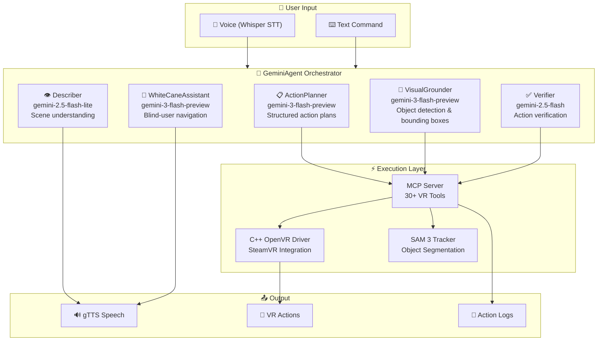
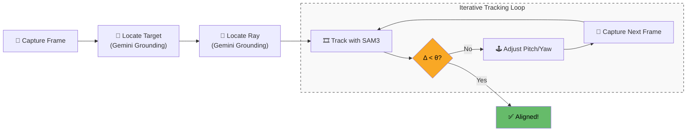

<div align="center">


# Gemini VR Interaction Kit

### 🧠 An AI agent that can **see**, **think**, **speak**, and **act** inside Virtual Reality.

[](https://python.org)
[](https://ai.google.dev/)
[](https://github.com/ValveSoftware/openvr)
[](https://github.com/facebookresearch/segment-anything-3)
[](LICENSE)

**Gemini VR Interaction Kit** is a full-stack AI agent that bridges Google's Gemini multimodal models with SteamVR through a custom OpenVR driver. It can navigate 3D environments, locate and track objects, type on virtual keyboards, assist blind users, and carry out complex multi-step tasks—all through natural language.

[Get Started](#-get-started) · [Architecture](#-multi-model-architecture) · [Features](#-key-features) · [Tools](#%EF%B8%8F-30-vr-tools) · [Demo](#-demo)

</div>

---

## ✨ Key Features

<table>
<tr>
<td width="50%">

### 🎯 Visual Grounding & Servo Alignment
Locate any object in the VR scene by name, then **visually servo** the controller ray onto it with sub-pixel precision—closed-loop feedback using real-time frame captures.

</td>
<td width="50%">

### ⌨️ Virtual Keyboard Typing
Type arbitrary text on **any** VR keyboard. The agent grounds every unique character in a single API call, then servo-aligns and clicks each key sequentially.

</td>
</tr>
<tr>
<td>

### 🦯 White Cane Accessibility Mode
A first-of-its-kind **blind-user navigation assistant** for VR. Performs 360° environment scans (0°, 90°, 180°, 270°), builds temporal context from image history, and speaks natural-language directions via TTS.

</td>
<td>

### 🎬 SAM 3 Object Tracking
Detects an object in the first frame, then tracks it across a video sequence using **Meta's Segment Anything Model 3**—producing segmented, annotated tracking videos.

</td>
</tr>
<tr>
<td>

### 🗣️ Voice-Controlled Menus
Full push-to-talk voice control with **Whisper STT** and **gTTS TTS**. Hierarchical voice menus let users trigger tasks, switch modes, or navigate hands-free.

</td>
<td>

### 🕹️ Full Controller Emulation
30+ tools for **buttons, triggers, joysticks, grips, and trackpads**—press, hold, click, analog values, directional inputs, grab/release gestures, and full pose control.

</td>
</tr>
</table>

---

## 🧠 Multi-Model Architecture

The agent orchestrates **5 specialized Gemini models**, each optimized for a distinct cognitive task:



| Model | Role | Why This Model |
|-------|------|----------------|
| `gemini-3-flash-preview` | **Planning** — Decomposes requests into tool-call sequences | Fast structured output with tool-use schema |
| `gemini-3-flash-preview` | **Grounding** — Returns bounding boxes for objects in the scene | Best-in-class multimodal spatial reasoning |
| `gemini-2.5-flash` | **Verification** — Confirms actions completed correctly | Balanced speed / accuracy for yes/no checks |
| `gemini-2.5-flash-lite` | **Description** — Answers questions about the scene | Lightweight, fast, cost-efficient |
| `gemini-3-flash-preview` | **White Cane** — Multi-image analysis for blind navigation | Handles multi-image prompts with temporal context |

---

## 🏗️ System Architecture

```
GEMINI_Comp_VR/OpenEye/
├── gemini_vr_agent_v8.py      # 🧠 Main agent (this file — 3,100+ lines)
├── mcp_server.py              # 🔌 MCP tool server (30+ VR tools)
├── keyboard_controller.py     # ⌨️ WASD keyboard control for VR navigation
├── object_tracker.py          # 🎬 SAM 3 integration for object tracking
├── controllertracker.py       # 📡 Real-time controller pose tracking
│
├── csamplecontrollerdriver.*  # 🎮 C++ OpenVR controller driver
├── csampledevicedriver.*      # 🥽 C++ OpenVR headset driver
├── cframecapture.*            # 📸 C++ frame capture from SteamVR
├── cposedatareceiver.*        # 📡 C++ TCP pose receiver
├── cvisionserver.*            # 👁️ C++ vision data server
├── cserverdriver_sample.*     # 🔧 C++ driver entry point
│
├── assets/                    # 🎨 Images, videos, model assets
├── requirements.txt           # 📦 Python dependencies
└── default.vrsettings         # ⚙️ SteamVR driver configuration
```

---

## 🛠️ 30+ VR Tools

The agent exposes a rich tool library through the MCP server. Every tool is callable by the Gemini planner or directly via text commands.

<details>
<summary><b>🚀 Movement & Positioning</b></summary>

| Tool | Description |
|------|-------------|
| `move_relative` | Move a device relative to current position |
| `move_absolute` | Move a device to absolute coordinates |
| `teleport` | Instant teleport to exact coordinates |
| `rotate_device` | Rotate device by pitch/yaw/roll (degrees) |
| `get_current_pose` | Get position & rotation of any device |
| `reset_controller_positions` | Reset controllers to natural positions |
| `reset_controller_orientation` | Reset controllers to default orientation |
| `position_controller_relative_to_headset` | Place controller relative to headset |

</details>

<details>
<summary><b>🎮 Input & Controller</b></summary>

| Tool | Description |
|------|-------------|
| `press_button` | Press and hold a button (trigger, grip, menu, a, b, trackpad) |
| `release_button` | Release a previously pressed button |
| `click_button` | Press and release with configurable duration |
| `set_trigger` | Set analog trigger value (0.0 – 1.0) |
| `set_joystick` | Set joystick/trackpad position (x, y) |
| `move_joystick_direction` | Move joystick in cardinal direction |
| `click_trackpad_direction` | Click trackpad in a direction |
| `perform_grab` | Grip + trigger combo for grabbing objects |
| `perform_release` | Release a grabbed object |
| `release_all_inputs` | Emergency reset all inputs |
| `get_controller_state` | Read current button/joystick state |

</details>

<details>
<summary><b>👁️ Vision & Perception</b></summary>

| Tool | Description |
|------|-------------|
| `inspect_surroundings` | Capture current frame from VR headset |
| `locate_object` | Find an object and return center coordinates |
| `track_object` | Track an object using SAM 3 segmentation |
| `track_multiple_items` | Track multiple objects simultaneously |
| `create_tracking_video` | Generate segmented tracking video |
| `capture_video` | Record a video clip (configurable duration) |
| `visual_servo_to_object` | Closed-loop align controller ray to target |

</details>

<details>
<summary><b>🦯 Accessibility & Audio</b></summary>

| Tool | Description |
|------|-------------|
| `white_cane_describe` | Immediate scene description for blind users |
| `white_cane_set_goal` | Set/update navigation goal |
| `perform_360_scan` | Four-direction panoramic scan with analysis |
| `speak` | Text-to-speech output (gTTS) |
| `listen` | Speech-to-text input (Whisper) |

</details>

<details>
<summary><b>⌨️ Automation</b></summary>

| Tool | Description |
|------|-------------|
| `type_text` | Type text on any VR keyboard (visual servo per key) |
| `open_menu_sequence` | Automated menu opening with rigid poses |
| `start_bridge` | Initialize VR bridge connection |
| `get_connection_status` | Check driver connection health |
| `kill_address` | Kill process on occupied TCP port |

</details>

---

## 🦯 White Cane Mode — VR Accessibility

White Cane mode transforms the agent into a **real-time navigation assistant for blind users** in VR:

```
┌─────────────────────────────────────────────────────┐
│  White Cane Mode                                    │
│                                                     │
│  1. 🔄 360° Scan — Captures at 0°, 90°, 180°, 270° │
│  2. 🧠 Multi-image analysis with Gemini             │
│  3. 🗣️ Speaks directions: "Door is 3 steps ahead,   │
│        slightly to your left"                       │
│  4. 🔁 Continuous loop with history for context     │
│  5. 🎯 Goal-oriented: "Find the exit" / "Explore"  │
│                                                     │
│  Voice Commands:                                    │
│  • "help" — Immediate scene description             │
│  • "scan" — Full 360° scan                          │
│  • "goal: find the door" — Update navigation goal   │
│  • "stop" — Deactivate white cane mode              │
└─────────────────────────────────────────────────────┘
```

---

## 🚀 Get Started

### Prerequisites

- **Python 3.10+**
- **SteamVR** installed and configured
- **Google Gemini API Key** ([Get one here](https://ai.google.dev/))
- **Linux (WSL2)** (The system has been extensively tested in **WSL2**)

### 1. Clone the Repository

```bash
git clone https://github.com/your-username/GEMINI_Comp_VR.git
cd GEMINI_Comp_VR/OpenEye
```

### 2. Set Up the Virtual Environment

```bash
python -m venv venv
source venv/bin/activate        # Linux/WSL
pip install -r requirements.txt
```

### 3. Configure Environment Variables

Create a `.env` file in the `OpenEye` directory:

```env
GEMINI_API_KEY=your_api_key_here
```

### 4. Install the OpenVR Driver

The agent communicates with SteamVR through a custom **Null Driver**. There are two ways to get it set up:

#### Option A — Use the Pre-Built Driver

A pre-compiled driver DLL for Windows (for use with WSL2 + SteamVR) is included:

```
OpenEye/bin/drivers/sample/bin/win64/driver_null.dll
```

Copy it to your SteamVR null driver directory (typically on the Windows host if using WSL2):

```bash
# Example for WSL2 accessing Windows SteamVR path
cp "bin/drivers/sample/bin/win64/driver_null.dll" \
   "/mnt/{path to Steam}/steamapps/common/SteamVR/drivers/null/bin/win64/"
```

> [!NOTE]
> Your Steam installation path may differ. Replace `{path to Steam}` with your actual Steam install location (`C:\Program Files (x86)\Steam`).

#### Option B — Build from Source

```bash
mkdir build && cd build
cmake ..
cmake --build . --config Release
```

Then copy the resulting `driver_null.dll` from the build output to:
```
{path to Steam}/steamapps/common/SteamVR/drivers/null/bin/win64/
```

#### Enable the Null Driver in SteamVR

Open your SteamVR configuration file:

```
{path to Steam}/config/steamvr.vrsettings
```

Add (or merge) the following JSON into the file:

```json
{
    "driver_null" : {
      "enable" : true,
      "id" : "Null Driver",
      "renderHeight" : 1080,
      "renderWidth" : 1920,
      "tcpEnabled" : true,
      "tcpHost" : "127.0.0.1",
      "tcpPort" : 5555,
      "visionEnabled" : true,
      "windowHeight" : 1080,
      "windowWidth" : 1920,
      "windowX" : 100,
      "windowY" : 100
   },
   "power" : {
      "overrideWindowsPowerScheme" : true,
      "pauseCompositorOnStandby" : false,
      "powerOffOnExit" : false,
      "turnOffControllersTimeout" : 0,
      "turnOffScreensTimeout" : 300
   }
}
```

> [!IMPORTANT]
> The `tcpEnabled` and `visionEnabled` fields must be `true` for the agent to receive pose data and capture frames from SteamVR.

### 5. Run the Agent

```bash
python gemini_vr_agent_v8.py
```

You'll see:
```
VR Agent v4 (Multi-Model) Ready.
Commands: 'white cane' to activate accessibility mode, 'quit' to exit.
```

---

## 💬 Usage Examples

### Natural Language Tasks
```
> Open up the menu
  📋 Planning → 🎯 Calls the open_menu tool → ✅ Verify

> Click the <NAME_OF_ROOM> room
  📋 Planning → 🎯 Locate "<NAME_OF_ROOM> room" → 🕹️ Servo + click → ✅ Verify

> Describe what's in front of me
  📸 Capture → 👁️ Describe → 🔊 Speak result
```

### Direct Commands
```
> ((move_relative headset 0 0 -0.5))     # Lisp-style direct tool calls
> ((rotate_device controller2 0 45 0))    # Rotate right controller 45° yaw
> ((click_button controller1 trigger))     # Click left trigger
```

### White Cane Mode
```
> white cane
  What would you like to find? > find the exit door
  🦯 White Cane activated. Scanning...
  🔊 "You are in a large room. The exit door is approximately 10 steps 
      ahead and slightly to your right."
```

---

## 🎯 Visual Servo Pipeline

The visual servo system leverages Gemini for initial grounding and then transitions to a **closed-loop SAM3 tracking process** that iteratively aligns a VR controller ray to any target object:



The agent iteratively adjusts controller pitch and yaw using adaptive gain until the ray center aligns with the target center within a configurable pixel threshold.

---

## 🔧 Configuration

The agent saves its configuration to `agent_config.json`:

```json
{
  "startup_message": true,
  "tts_enabled": true,
  "stt_enabled": true,
  "voice_confirmation": true,
  "auto_verify": true
}
```

| Setting | Description | Default |
|---------|-------------|---------|
| `startup_message` | Speak welcome message on launch | `true` |
| `tts_enabled` | Enable text-to-speech output | `true` |
| `stt_enabled` | Enable speech-to-text input | `true` |
| `voice_confirmation` | Announce actions before executing | `true` |
| `auto_verify` | Verify actions with the verification model | `true` |

---

## 📦 Tech Stack

| Component | Technology |
|-----------|-----------|
| AI Models | Google Gemini 3 Flash, 2.5 Flash, 2.5 Flash Lite |
| VR Runtime | SteamVR / OpenVR |
| VR Driver | Custom C++ OpenVR driver |
| Object Tracking | Meta SAM 3 (Segment Anything Model 3) |
| Speech-to-Text | OpenAI Whisper |
| Text-to-Speech | Google TTS (gTTS) |
| Vision | OpenCV, NumPy |
| Tool Server | MCP (Model Context Protocol) Server |
| Language | Python 3.10+, C++ |

---

## 🏆 What Makes This Special

<table>
<tr>
<td align="center" width="33%">
<h3>🧠 Multi-Model AI</h3>
Not just one LLM—<b>5 specialized models</b> working in concert, each optimized for its role in the perception-planning-action loop.
</td>
<td align="center" width="33%">
<h3>👁️ Closed-Loop Vision</h3>
Real visual servo control with <b>sub-pixel alignment</b>—the agent sees, acts, and corrects in a continuous feedback loop.
</td>
<td align="center" width="33%">
<h3>♿ Accessibility First</h3>
The <b>White Cane</b> mode is a genuine accessibility innovation—making VR navigable for blind users through spatial audio descriptions.
</td>
</tr>
<tr>
<td align="center">
<h3>🔧 Full-Stack Integration</h3>
From <b>C++ OpenVR drivers</b> to <b>Python AI agents</b> to a <b>React control panel</b>—a complete hardware-to-AI pipeline.
</td>
<td align="center">
<h3>⌨️ Keyboard Autonomy</h3>
The agent can <b>type on any VR keyboard</b> by grounding characters visually and servo-aligning to each key—zero hardcoded layouts.
</td>
<td align="center">
<h3>🎬 Real-Time Tracking</h3>
<b>SAM 3</b> integration enables real-time object segmentation and tracking across video sequences captured from VR.
</td>
</tr>
</table>

---

<div align="center">

**Built with ❤️ using Google Gemini, SteamVR, and Meta SAM 3**

*Gemini VR Interaction Kit — Giving AI eyes, hands, and a voice in Virtual Reality.*

</div>
